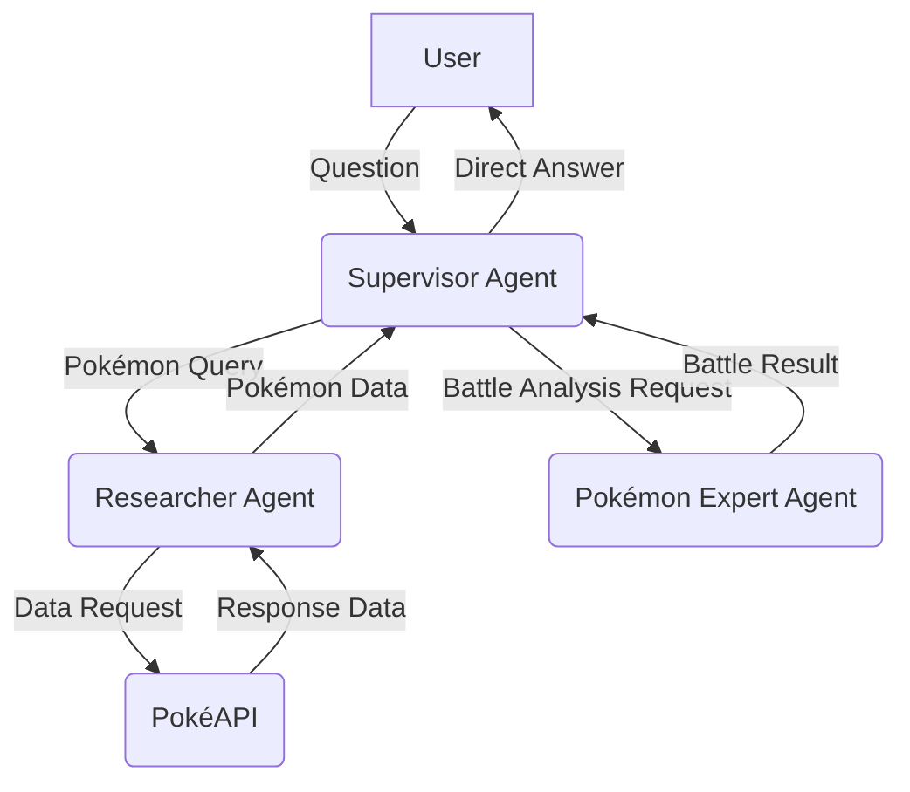

# Pokémon API: A Multi-Agent System

## Introduction

This project implements a multi-agent system using LangChain, LangGraph, and FastAPI to create a Pokémon-themed API.  The API allows users to ask general questions, retrieve Pokémon data, and simulate Pokémon battles. The system leverages a Supervisor Agent to orchestrate specialized agents (Researcher and Pokémon Expert), demonstrating autonomous decision-making, external data fetching, and analytical capabilities.  The project fulfills all requirements of the AI Engineering Challenge, including a multi-agent architecture, clean code, API best practices, Dockerization, testing, and comprehensive documentation.

## Project Structure

The project is organized into the following directory structure:

```
└── ./
    ├── pokemon/          # Main application package
    │   ├── agents/       # Contains the agent implementations
    │   │   ├── __init__.py
    │   │   ├── pokemon_expert.py  # Logic for battle analysis
    │   │   ├── researcher.py       # Logic for fetching data from PokeAPI
    │   │   └── supervisor.py      # Orchestrates the other agents
    │   ├── core/          # Core components and configuration
    │   │   ├── __init__.py
    │   │   └── config.py         # Configuration settings (API keys, etc.)
    │   ├── routers/      # FastAPI routers for different endpoints
    │   │   ├── __init__.py
    │   │   ├── battle.py          # /battle endpoint
    │   │   └── chat.py            # /chat endpoint
    │   ├── __init__.py
    │   └── main.py         # FastAPI application setup and main entry point
    ├── tests/            # Unit tests
    │   ├── __init__.py
    │   ├── test_battle.py
    │   ├── test_chat.py
    │   ├── test_main.py
    │   ├── test_researcher.py
    │   └── test_supervisor.py
    ├── Dockerfile      # Docker configuration for containerization
    ├── make.ps1        # PowerShell make script (Windows)
    ├── Makefile        # Make script (Linux/macOS)
    ├── requirements.txt   # Project dependencies
    └── run.py          # Script to run the application locally
```

*   **`pokemon/`**:  This is the main application package.
    *   **`agents/`**: This directory contains the implementations of the three agents: `supervisor.py`, `researcher.py`, and `pokemon_expert.py`.  Each agent is a class with methods for its specific tasks.  The `__init__.py` file makes this a Python package.
    *   **`core/`**:  This directory holds core components. `config.py` manages configuration settings, such as API keys and environment variables, loaded from a `.env` file.
    *   **`routers/`**: This directory contains the FastAPI routers. `battle.py` defines the `/battle` endpoint, and `chat.py` defines the `/chat` endpoint. Each router handles requests to its respective endpoint and interacts with the appropriate agents.
    *   **`main.py`**: This file sets up the FastAPI application, includes the routers, and defines a simple root route.  It's the entry point for the API.
*   **`tests/`**: This directory contains unit tests for the API endpoints and agent functionalities.  The tests are written using `pytest` and cover various scenarios, including successful responses, error handling, and mocked external calls.
*   **`Dockerfile`**:  This file defines how to build a Docker image for the application, ensuring consistent and reproducible deployments.
*   **`make.ps1` and `Makefile`**: These are convenience scripts for building, running, stopping, and cleaning the application (both locally and with Docker).  `make.ps1` is for PowerShell (Windows), and `Makefile` is for traditional Make (Linux/macOS).
*   **`requirements.txt`**: This file lists all the Python dependencies of the project, allowing for easy installation using `pip`.
*   **`run.py`**: This script uses `uvicorn` to run the FastAPI application locally, useful for development and testing.

## Agents

The system comprises three main agents:



1.  **Supervisor Agent (`supervisor.py`):**  The central orchestrator.  It receives user queries and decides how to handle them:
    *   **Direct Answer:** For general knowledge questions (e.g., "What is the capital of France?"), the Supervisor answers directly using its internal LLM.
    *   **Pokémon Research:** For general questions about Pokémon, it uses the Researcher Agent's query endpoint.
    *   **Pokémon Data:** For questions requiring specific Pokémon data (e.g., "What are the base stats of Charizard?"), it delegates to the Researcher Agent to fetch data from the PokéAPI.
    *   **Battle Analysis:** For questions about Pokémon battles (e.g., "Who would win, Pikachu or Bulbasaur?"), it delegates to the Pokémon Expert Agent.
    *   It uses LangGraph to define a state machine and structured output via Pydantic to direct the flow.

2.  **Researcher Agent (`researcher.py`):**  Responsible for fetching data from the PokéAPI:
    *   Provides tools (`get_pokemon_data`, `compare_pokemon`) to retrieve detailed information about Pokémon, including stats, types, abilities, and more.
    *   Handles errors gracefully, such as when a Pokémon is not found.
    *   Uses LangChain tools and an Anthropic model for interaction.

3.  **Pokémon Expert Agent (`pokemon_expert.py`):**  Analyzes Pokémon battles:
    *   Provides a tool (`compare_pokemon_data`) that takes two Pokémon names, retrieves their data (via the Researcher Agent), compares their stats and types, and determines a likely winner.
    *   Offers individual tools for type effectiveness calculation (`get_type_effectiveness`) and stat comparison (`analyze_stats_comparison`), enabling detailed analysis.
    *    Provides a method `determine_winner` that performs a complete battle analysis between the two pokemons.
    *   Uses LangChain tools and an Anthropic model for reasoning and prediction, including structured output for a clear winner and reasoning.

## API

The API is built using FastAPI and provides two main endpoints:

1.  **`/api/chat` (POST):**  A general chat endpoint for user queries.
    *   **Input:**  A JSON object with a `question` field (string).
    *   **Output:** A JSON object with an `answer` field (string) and an optional `reasoning` field (string).
    *   **Example:**
        ```json
        {
          "question": "Who would win in a battle, Pikachu or Bulbasaur?"
        }
        ```
        ```json
        {
          "answer": "Pikachu would win the battle.",
          "reasoning": "Pikachu has a type advantage and superior speed."
        }
        ```

2.  **`/api/battle` (GET):**  A dedicated endpoint for Pokémon battle simulations.
    *   **Input:**  Two query parameters, `pokemon1` and `pokemon2` (both strings).
    *   **Output:** A JSON object with `winner` and `reasoning` fields (both strings).
    *   **Example:**
        ```
        /api/battle?pokemon1=pikachu&pokemon2=bulbasaur
        ```
        ```json
        {
          "winner": "Pikachu",
          "reasoning": "Pikachu has a type advantage and superior speed."
        }
        ```
    *   This endpoint specifically uses LangSmith tracing with its own project name.

## Setup

1.  **Clone the repository:**

    ```bash
    git clone <repository_url>
    cd <repository_directory>
    ```

2.  **Set up a `.env` file:**

    Create a `.env` file in the root directory and add your Anthropic API key:

    ```
    ANTHROPIC_API_KEY=your_anthropic_api_key
    ```
    You can also configure LangSmith by adding:
    ```
    LANGCHAIN_API_KEY=your_langchain_api_key
    LANGCHAIN_PROJECT=pokemon-application # Or your desired project name
    ```

3.  **Install dependencies (using virtual environment - recommended):**

    ```bash
    python3 -m venv venv
    source venv/bin/activate  # On Linux/macOS
    .\venv\Scripts\activate  # On Windows
    pip install -r requirements.txt
    ```

4.  **Run the application (locally):**

    ```bash
    python run.py
    ```
    This will start the FastAPI server on `http://0.0.0.0:8000`. You can access the API documentation at `http://0.0.0.0:8000/docs`.

5. **Run with Docker:**
    ```bash
    make run
    ```
    or on windows
    ```powershell
    .\make.ps1 run
    ```

## Examples

### Using the `/api/chat` endpoint:

**General Knowledge Question:**

```bash
curl -X POST -H "Content-Type: application/json" -d '{"question": "What is the capital of France?"}' http://localhost:8000/api/chat
```

**Output:**

```json
{
  "answer": "The capital of France is Paris.",
  "reasoning": null
}
```

**Pokémon Data Retrieval:**

```bash
curl -X POST -H "Content-Type: application/json" -d '{"question": "What are the base stats of Charizard?"}' http://localhost:8000/api/chat
```

**Output:**

```json
{
    "answer": "{\n    \"name\": \"Charizard\",\n    \"id\": 6,\n    \"types\": [\n        \"Fire\",\n        \"Flying\"\n    ],\n    \"stats\": {\n        \"hp\": 78,\n        \"attack\": 84,\n        \"defense\": 78,\n        \"special_attack\": 109,\n        \"special_defense\": 85,\n        \"speed\": 100\n    },\n    \"height\": 17,\n    \"weight\": 905,\n    \"abilities\": [\n        \"Blaze\",\n        \"Solar power\"\n    ]\n}",
    "reasoning": null
}
```

**Pokémon Battle Question:**

```bash
curl -X POST -H "Content-Type: application/json" -d '{"question": "Who would win in a battle, Pikachu or Bulbasaur?"}' http://localhost:8000/api/chat
```
**Output:**
```json
{
  "answer": "Pikachu would win the battle.",
  "reasoning": "Pikachu, being an Electric-type, has a type advantage over Bulbasaur, which is a Grass/Poison-type.  Additionally, analysis of their base stats shows that Pikachu has a higher speed stat (90) compared to Bulbasaur (45), giving Pikachu an advantage in terms of attacking first."
}
```

### Using the `/api/battle` endpoint:

```bash
curl "http://localhost:8000/api/battle?pokemon1=pikachu&pokemon2=bulbasaur"
```

**Output:**

```json
{
  "winner": "Pikachu",
  "reasoning": "Pikachu, being an Electric-type, has a type advantage over Bulbasaur, which is a Grass/Poison-type.  Additionally, analysis of their base stats shows that Pikachu has a higher speed stat (90) compared to Bulbasaur (45), giving Pikachu an advantage in terms of attacking first."
}
```

## Tests

The `tests/` directory contains unit tests for the API endpoints and agent functionalities. To run the tests:

1.  **Make sure you are in the project's root directory.**
2.  **Ensure the virtual environment is activated (if you're using one).**
3.  **Run pytest:**

    ```bash
    pytest
    ```

This will execute all tests in the `tests/` directory and report the results.  The tests use `unittest.mock` to patch external calls (like API requests) and ensure that the code is working correctly in isolation.

## Final Remarks

This project demonstrates a well-structured multi-agent system for interacting with Pokémon data and simulating battles.  It showcases the power of LangChain and LangGraph for building complex, intelligent applications. The use of FastAPI makes it easy to interact with the system through a RESTful API.  The project is fully Dockerized for easy deployment and includes comprehensive tests for reliability. The use of Pydantic models for structured output and type hints throughout the codebase enhances maintainability and readability. The inclusion of both `Makefile` and `make.ps1` provides cross-platform convenience for common development tasks.

This README provides a clear, concise, and comprehensive guide to the project, covering all aspects from setup and usage to testing and deployment.  The project structure and code are well-organized and follow best practices for Python development.  The multi-agent architecture is well-designed and effectively utilizes the strengths of each agent. The API is well-defined and follows RESTful principles. The inclusion of thorough unit tests and a Dockerized environment ensures the reliability and deployability of the application.
